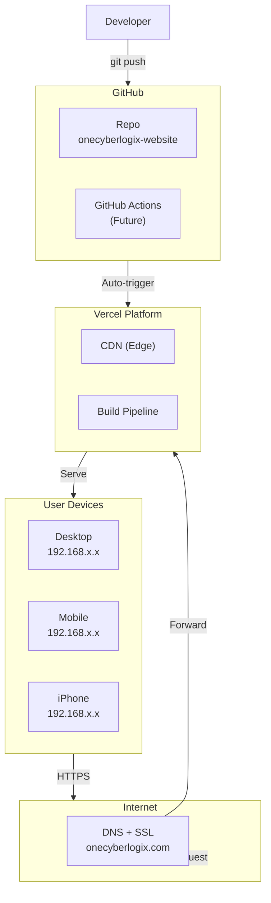
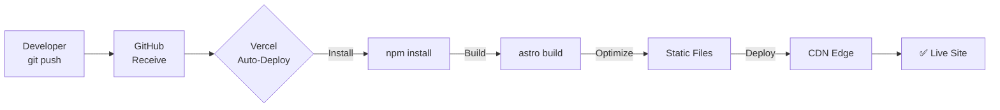
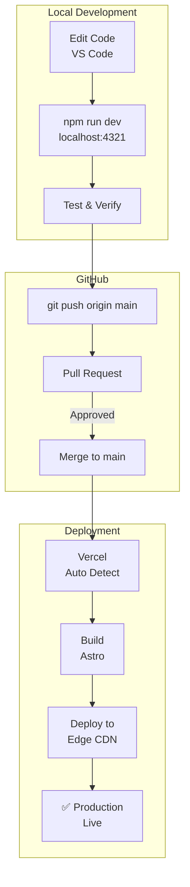
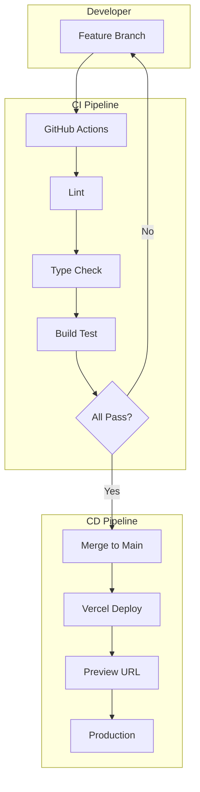
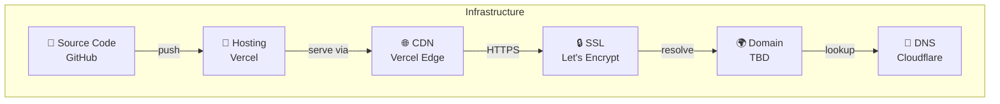

# OneCyberLogix - CI/CD Architecture (Mermaid Diagrams)

## System Architecture

## CI/CD Pipeline

## Development Workflow

## Future: Enhanced Pipeline

## Infrastructure Components

---

## Quick Reference

| Component | Technology | Purpose |
|-----------|------------|---------|
| Source Control | GitHub | Code storage & version |
| Hosting | Vercel | Static site hosting |
| CDN | Vercel Edge | Global content delivery |
| SSL | Vercel (free) | HTTPS encryption |
| Domain | TBD | Custom domain |
| CI/CD | Vercel Auto | Automatic deployments |
| Future: Lint | ESLint | Code quality |
| Future: Test | Vitest | Unit testing |
